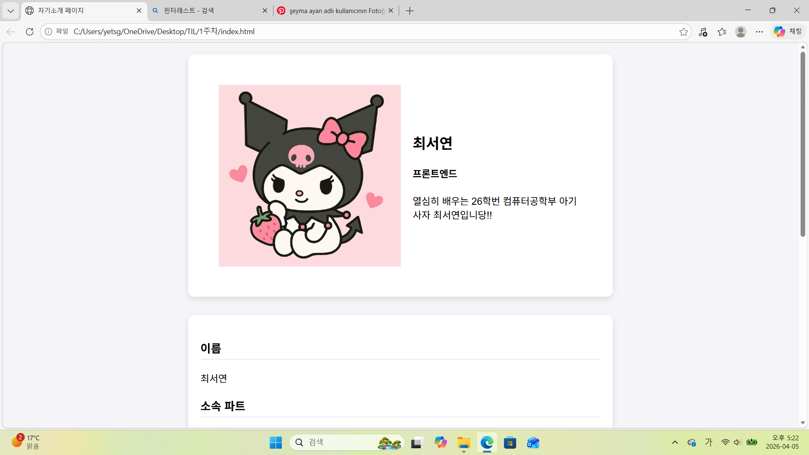
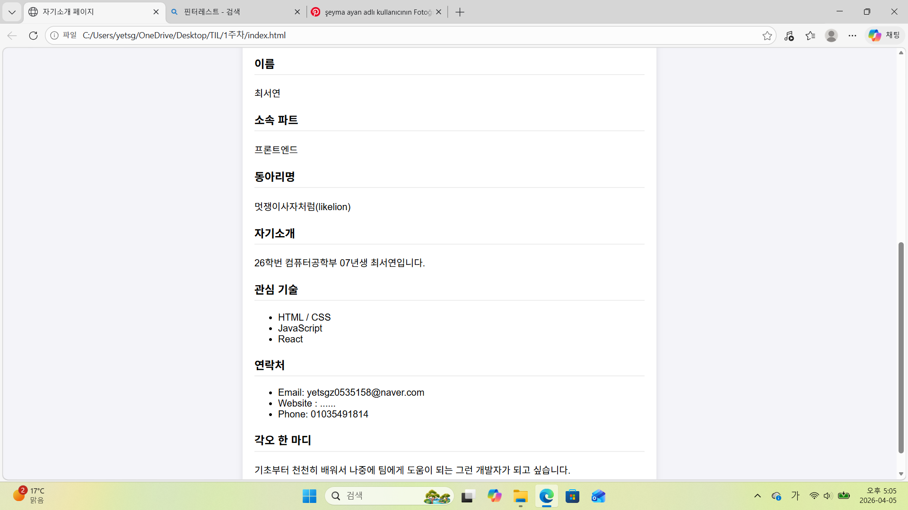
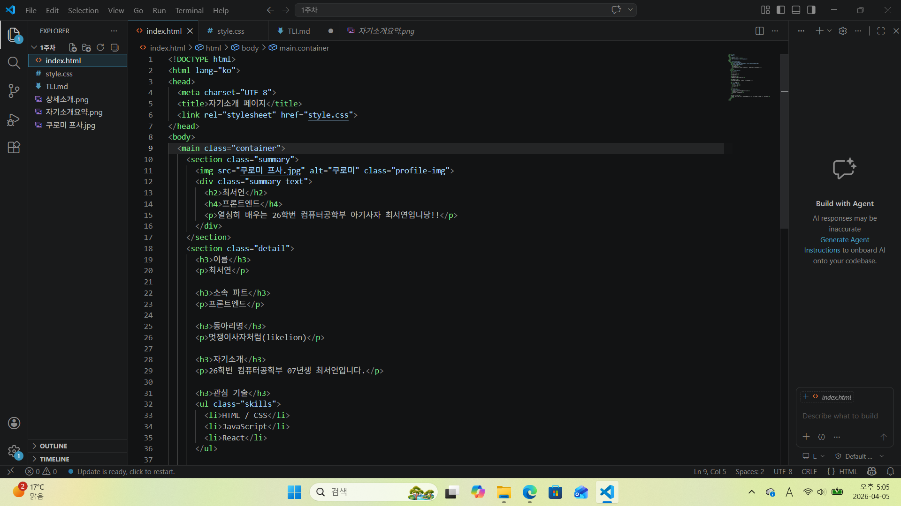
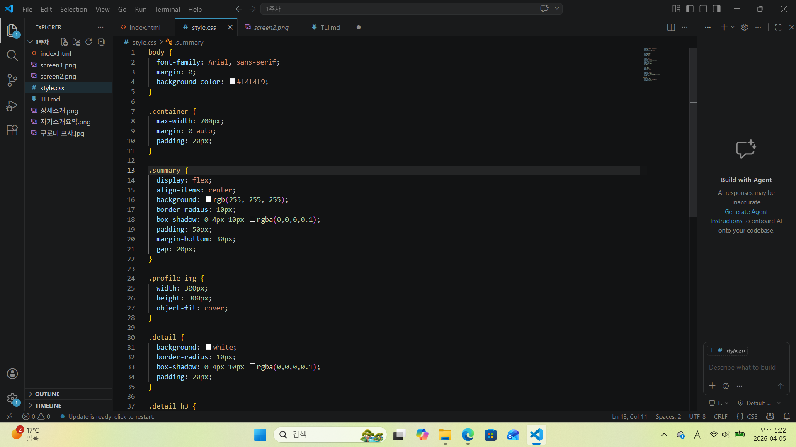

# 📘 Today I Learned

### 1. 오늘 배운 내용
- HTML/CSS 기초
    HTML 기본 구조와 각 부분에 맞는 역역 설정 및 사진 첨부.
    css를 통한 디자인 및 구성..?
- Flexbox 활용법
    display: flex;              
    align-items: center;
    gap: 20px
    등등을 통한 화면 크기 맞춤

### 2. 핵심 정리 (내 언어로)
웹페이지를 구성하는 프론트의 기본 기능들 = HTML은 정보 구조, CSS는 디자인, JS는 상호작용
flexbox 사용 이유 - 화면 크기가 달라져도 기본 상태 유지 가능

예전에 자주 보이던 코드였는데 무슨 이유로 사용하는 지, 이걸 뭐라고 부르는 지 몰랐는데 이에 대한 명칭과 flexbox를 사용하는 이유에 대해 알게 되었음. 

### 3. 결과 이미지(스크린샷)

### 4. 느낀 점
- css를 하나하나 설정하면서 내 스타일에 맞는 디자인을 할 수 있어서 재밌었다.
- 사진을 첨부하는 과정에서 많이 해매긴 했지만 직접 해봄으로써 다음부터는 뭔가 더 잘 할 수 있을 것 같다. 
