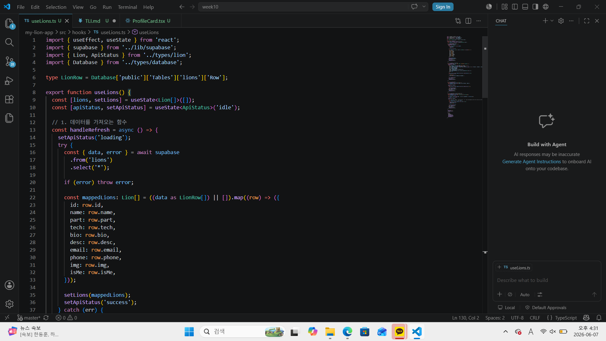
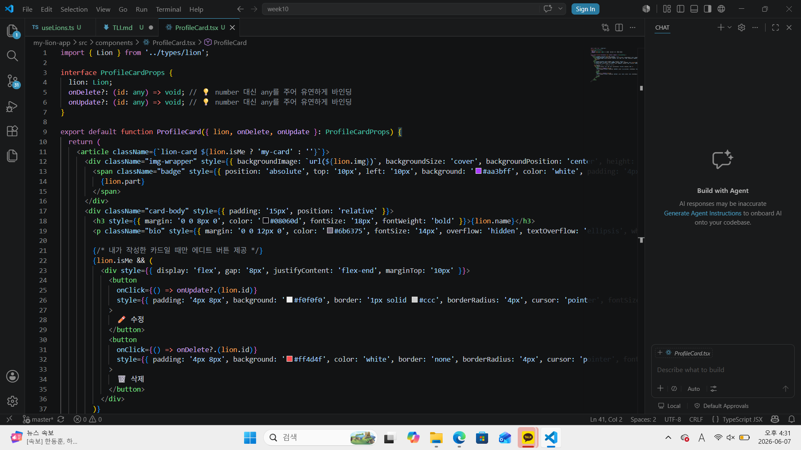

# 📘 Today I Learned

### 1. 오늘 배운 내용
- TypeScript 엄격한 타입 가드 우회 및 any 단언 처리
- 로컬 개발 환경과 프로덕션 배포용 빌드의 메커니즘 차이 이해
- Vercel 호스팅 플랫폼을 통한 지속적 배포 환경 구축 및 환경 변수 세팅
- 웹 표준 환경에서의 반응형 UI/UX 최종 검점 및 console.log 등 불필요한 코드 청소
- 실제 사용자의 피드백 분석을 통한 기능 개선 및 릴리즈 경험

### 2. 핵심 정리 (내 언어로)
any는 마법의 열쇠이자 양날의 검: Supabase 스키마 타입이 꼬여서 `never` 에러가 터질 때는 `as any`를 적절히 활용해 타입 가드를 풀어줘야 빌드라는 최종 관문을 막힘없이 통과할 수 있음.

환경 변수는 배포의 생명줄: 내 컴퓨터에선 `.env.local`이 알아서 작동하지만, Vercel로 배포할 때는 대시보드에 `VITE_SUPABASE_URL`과 `VITE_SUPABASE_ANON_KEY`를 직접 수동으로 수혈해 줘야만 빈 화면 대신 데이터가 정상적으로 흘러나옴.

방구석 코딩과 실제 서비스의 차이: `yarn dev`로 내 화면에서만 잘 나오는 건 반쪽짜리 기능일 뿐, 콘솔 에러를 다 지우고 `yarn build`를 돌려 세상에 주소로 내놓아야 비로소 진짜 웹 애플리케이션이 됨.

피드백은 성장의 지름길: 내가 만들 때는 안 보이던 버그나 불편한 레이아웃이 동료들이 직접 써보고 남겨준 피드백을 통해 보이기 시작하며, 이를 하나라도 직접 고쳐서 다시 push하는 과정이 진정한 개발 사이클의 완성임.

### 3. 결과 이미지(스크린샷)

### 4. 느낀 점
내 컴퓨터 안에서만 맴돌던 아기사자 대시보드를 실제 URL 주소로 배포하고 나니 진짜 서비스를 세상에 내놓은 것 같아 가슴이 벅찼습니다. 동료들의 피드백을 바탕으로 깐깐한 타입스크립트 에러를 모두 잡아내고 기능을 개선하는 과정을 통해, 한 단계 더 단단하게 성장한 개발자가 된 것 같아 뿌듯합니다.