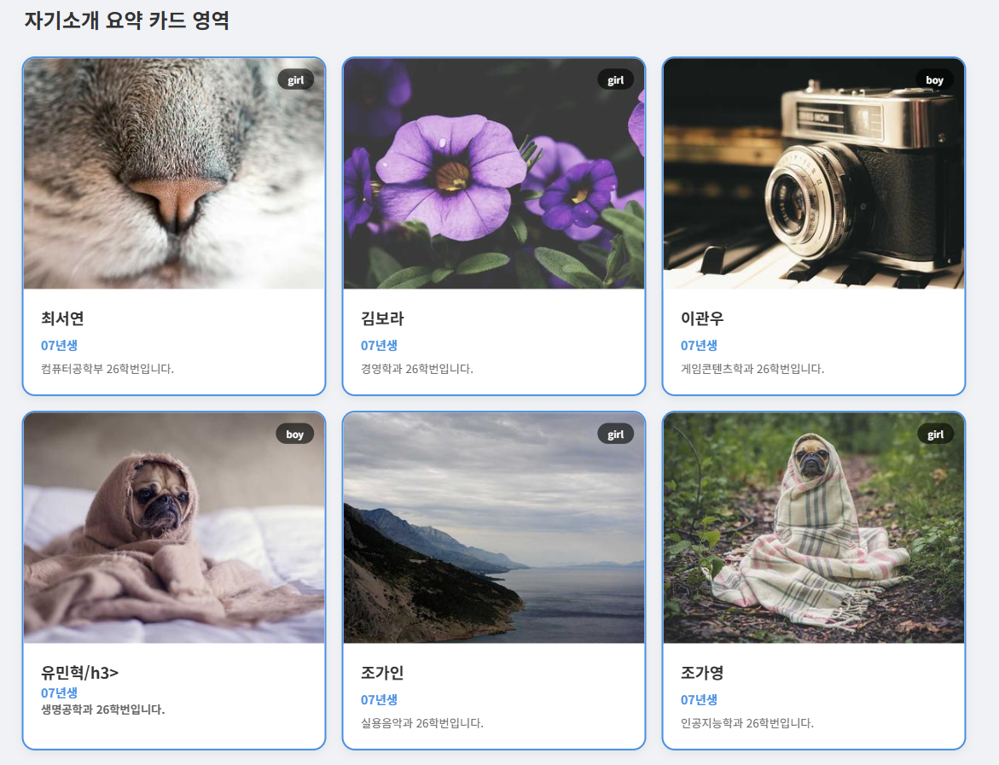
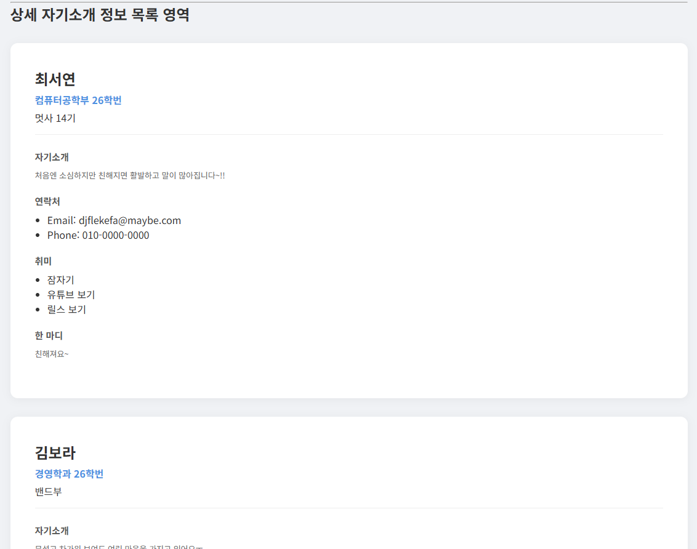
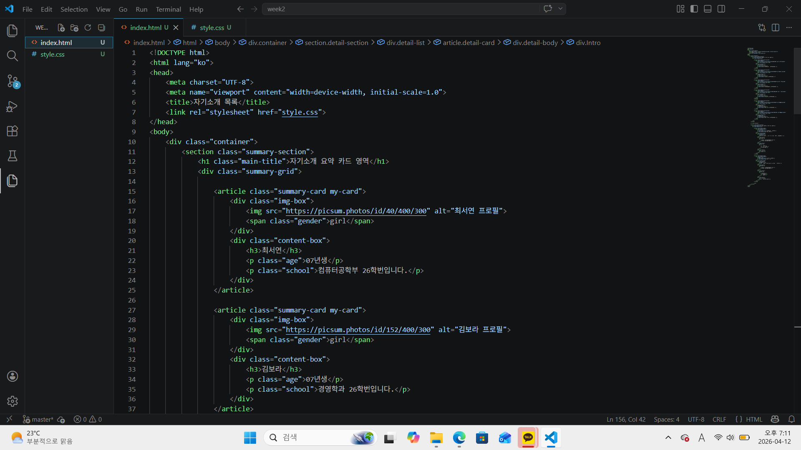
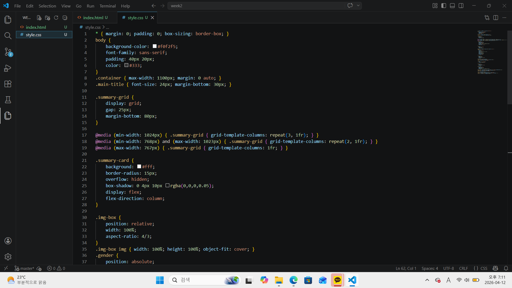

# 📘 Today I Learned

### 1. 오늘 배운 내용
- CSS 레이아웃/ 반응형

    레이아웃 설계를 통해 유연성, 유지보수, 일관성 유지함.

    모바일 : 화면이 좁으므로 카드를 1열로 배치
    태블릿 : 중간 크기 화면에서는 카드를 2열로 배치
    데스크톱 : 넓은 화면을 활용하여 카드를 3열로 배치

- Flexbox와 Grid의 차이

    Grid : 페이지 레이아웃의 가이드 라인

    Grid - 2차원 레이아웃, 레이아웃 중심 / Flexbox - 1차원 레이아웃, 콘텐츠 중심

- position 

    static : 모든 요소의 디폴트 값
    relative : 원래 위치를 기준으로 요소를 움직일 때 사용 
    absolute : position이 static이 아닌 가장 가까운 부모를 기준으로 함 - body를 기준으로 위치를 움직임 - 요소에 적용되면 float 등으로 발생하는 요소 간의 관계 무시
    fixed : 브라우저 창을 기준으로 고정된 위치
    sticky : 스크롤로 특정 위치에 도달하면 고정

### 2. 핵심 정리 (내 언어로)
float를 사용함으로써 margin이 사라지고 사라진 margin으로 인해 다음 div에 있던 컨텐츠가 범람하기에 clear 사용으로 대응 -> float와 clear 밀접한 관계
(margin이 생겨 범람하지 않는게 x, 투명벽..? 같은게 있어서 다음 div 컨텐츠가 ㅇㅋ 못 올라감 이런 느낌.)

데스크톱으로 작업한 경우 모바일이나 태블릿으로 사용하면 화면상의 구조나 크기, 배열이 다 망가지기에 반응형을 고려해 미리 설정해둬야함. 

absolute가 position이 static이 아닌 가장 가까운 부모(body), 즉 거의 relative를 기준으로 위치를 움직임 -> relative 기준에 맞게 absolute의 값을 지정하면 그에 맞게 변하기에 relative의 부속품이라고 볼 수 있음.

### 3. 결과 이미지(스크린샷)

### 4. 느낀 점
- css 반응형을 지정함으로써 핸드폰을 사용하든 태블릿을 사용하든 그에 맞는 화면 구조를 잡을 수 있다는 것이 놀라웠다. 
- 처음엔 Flexbox와 Grid의 차이를 이해하는 게 좀 어려웠지만 따로 찾아보면서 더 쉽게 이해하게 된 것 같아 기분이 좋았다. 
