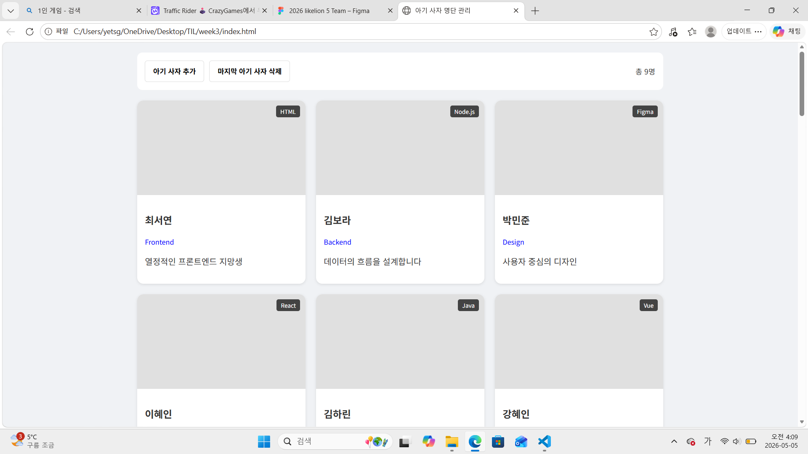
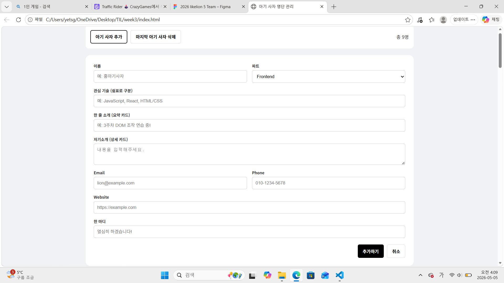
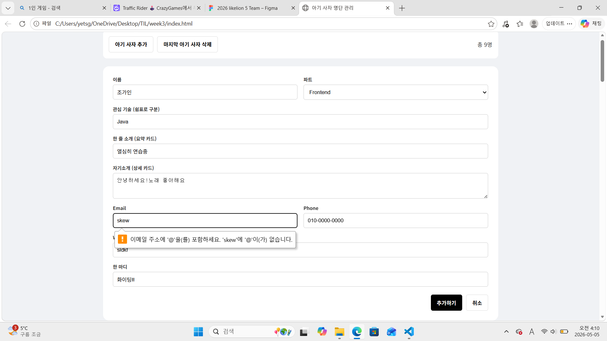
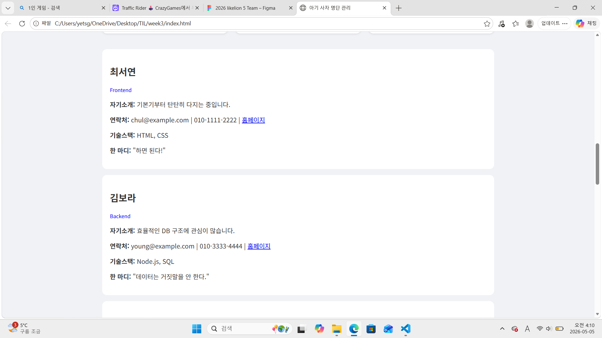
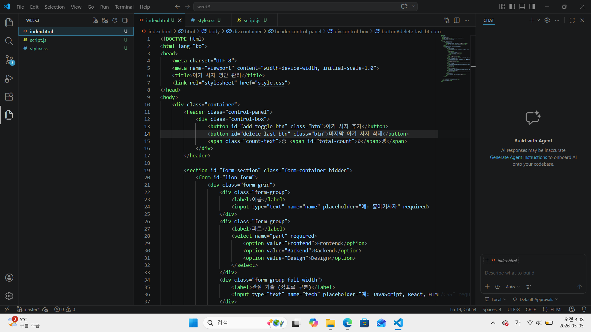
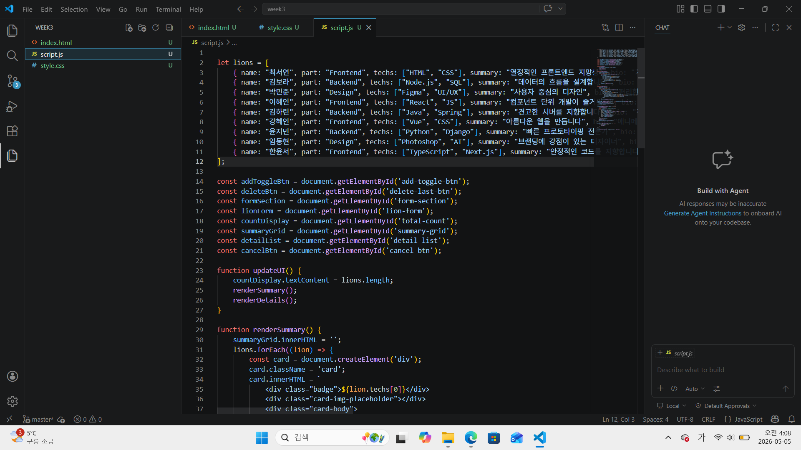
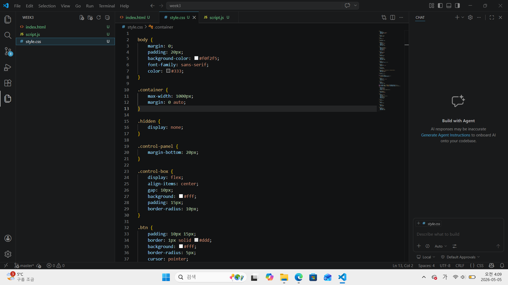

# 📘 Today I Learned

### 1. 오늘 배운 내용
-DOM 조작과 데이터 동기화
    상태 관리: 자바스크립트 배열을 단일 데이터 소스로 활용하여, 데이터가 추가되거나 삭제될 때마다 화면이 자동으로 갱신되도록 구현.

    실시간 카운팅: 명단 배열의 길이를 실시간으로 추적하여 "총 n명"이라는 텍스트에 즉각 반영하는 로직 학습.

- 이벤트 기반 인터랙션
    폼 제어: addEventListener를 사용하여 '추가' 버튼 클릭 시 입력 폼을 토글하고, 취소 버튼 클릭 시 입력 내용을 초기화하는 UX 구현.

    데이터 추가/삭제: FormData 객체를 통해 입력값을 수집하고, 배열의 push()와 pop() 메서드를 사용하여 명단을 동적으로 제어.

### 2. 핵심 정리 (내 언어로)
데이터가 변하면 화면도 변화 - 모든 정보는 JS 배열에 담고, 배열이 바뀔 때마다 화면을 새로 그려주는 updateUI 흐름을 이해함.

사용자 경험 고려 - 필수 입력값이 빠지면 브라우저가 경고를 띄우게 하고, 작업 완료 후엔 자동으로 폼을 닫아 편리함을 더함.

초기 데이터의 중요성 - 빈 화면이 아니라 기본 데이터 9개를 미리 로드하여 서비스의 첫인상을 구성하는 법을 익힘.

### 3. 결과 이미지(스크린샷)

### 4. 느낀 점
- 단순히 HTML을 하나씩 직접 작성하는 게 아니라, 자바스크립트의 데이터를 조작하면 화면이 그에 맞춰 자동으로 업데이트되는 흐름을 설계하는 과정이 처음에는 꽤 생소하면서도 논리적으로 느껴졌음.

- 버튼을 눌렀을 때 폼을 띄우고, 데이터를 추가한 뒤 다시 폼을 초기화하고 숨기는 일련의 과정들을 addEventListener를 통해 순차적으로 연결하는 로직이 가장 신경 써야 할 부분이면서도 구현했을 때 가장 뿌듯한 고비였던 것 같음.
