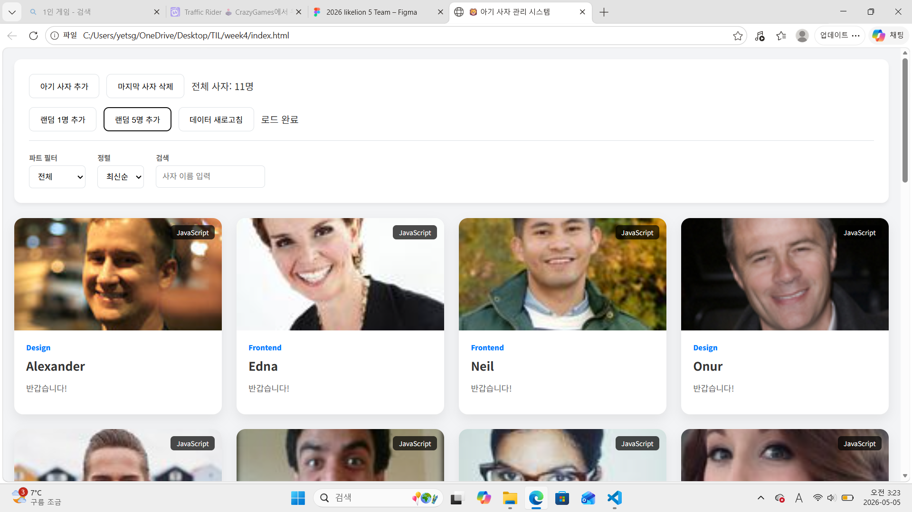
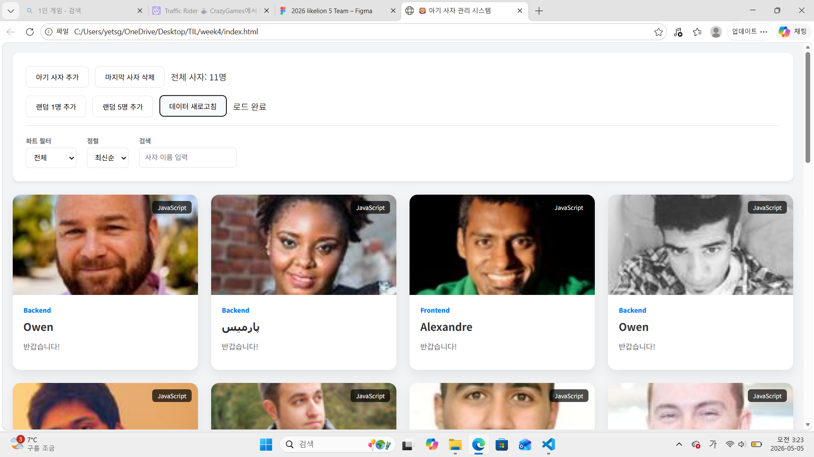
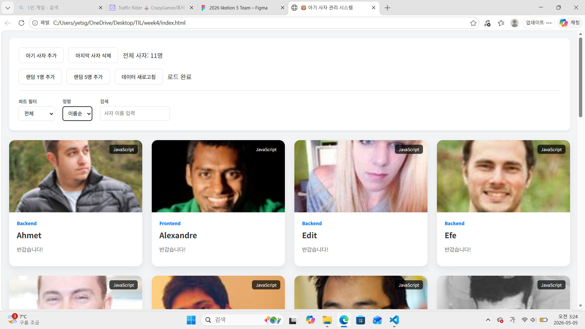
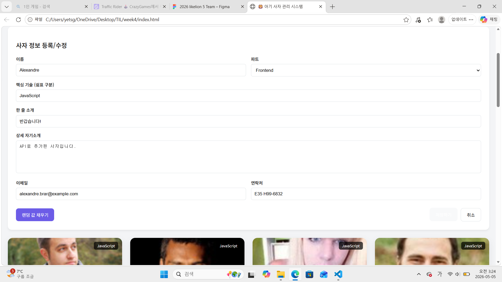
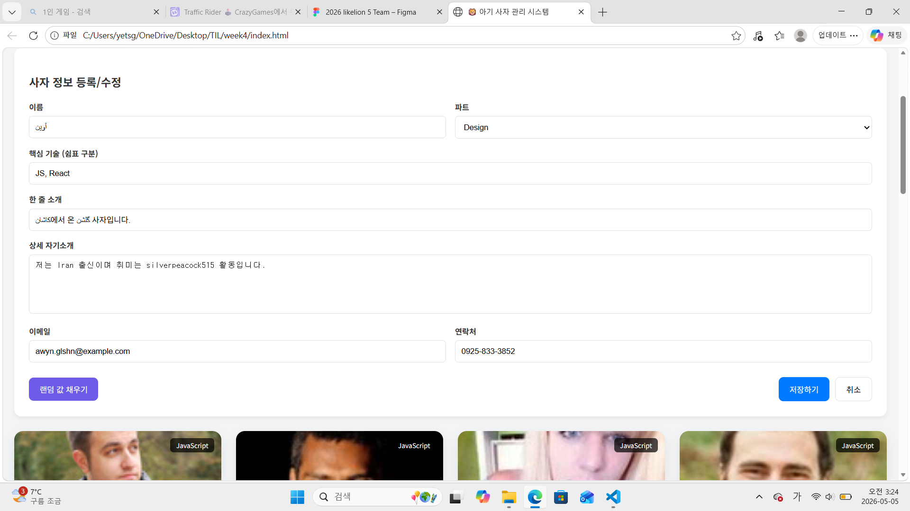
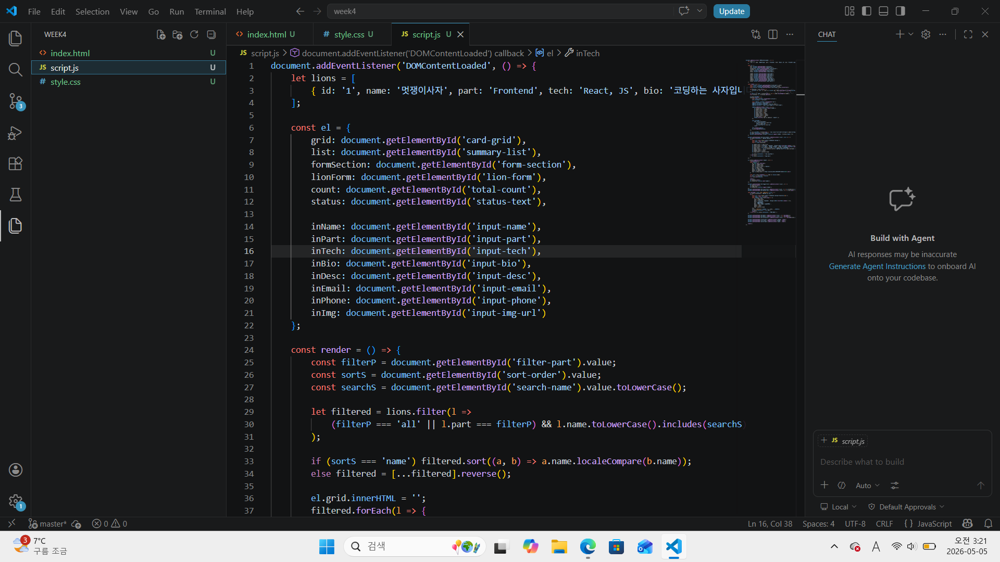
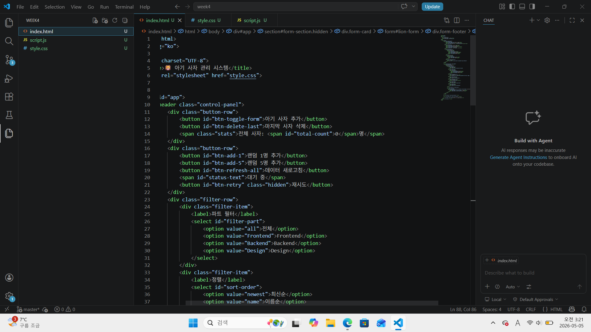
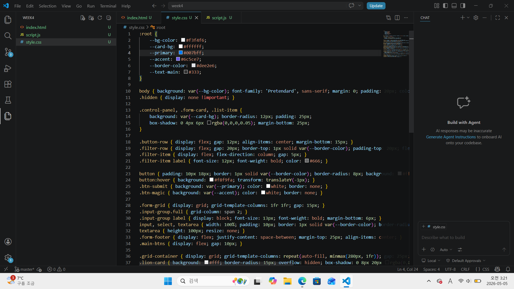

# 📘 Today I Learned

### 1. 오늘 배운 내용
- 비동기 통신과 데이터 흐름 
    요청 → 대기 → 응답 처리: fetch()를 호출하고 응답이 올 때까지 기다린 후, .json()으로 변환하여 사용하는 일련의 과정을 async/await로 구현.

    데이터 변환: 외부 API에서 받은 사람 데이터를 우리 시스템에 맞는 데이터 형식으로 가공하여 상태에 반영.

- 비동기 상태에 따른 UI 제어
    로딩 및 상태 피드백: 데이터를 불러오는 동안 status-text를 통해 "모집 중...", "완료!"와 같은 메시지를 노출하여 사용자에게 현재 상황을 알림.

    예외 처리: try...catch 문을 사용하여 네트워크 오류나 API 응답 실패 시에도 프로그램이 멈추지 않고 "연결 실패" 메시지를 띄우도록 설계.

### 2. 핵심 정리 (내 언어로)
JS 비동기와 데이터 처리 = 외부에서 데이터를 가져오고, 기다렸다가, 화면에 뿌려주는 흐름 이해함.

이미지 클릭과 폼 연동 - 카드를 누르면 그 정보가 폼에 바로 입력되도록 JS로 연결 가능함.

API 활용의 유연성 - 데이터는 사람 정보를 가져와도 사진 주소만 살짝 바꾸면 고양이 사진으로 출력 가능함. 

### 3. 결과 이미지(스크린샷)

### 4. 느낀 점
- 외부 API에서 데이터를 가져올 때 발생하는 요청 → 대기 → 응답의 흐름을 async/await로 제어하는 과정이 처음에는 순서가 꼬이는 것 같아 꽤나 복잡하게 느껴졌음.

- 단순히 텍스트만 불러오는 게 아니라 고양이 이미지 같은 외부 리소스를 실시간으로 매칭하고 비동기 상태에 따라 UI를 유연하게 바꾸는 로직을 짜는 부분이 가장 까다로우면서도 핵심적인 고비였던 것 같음.
