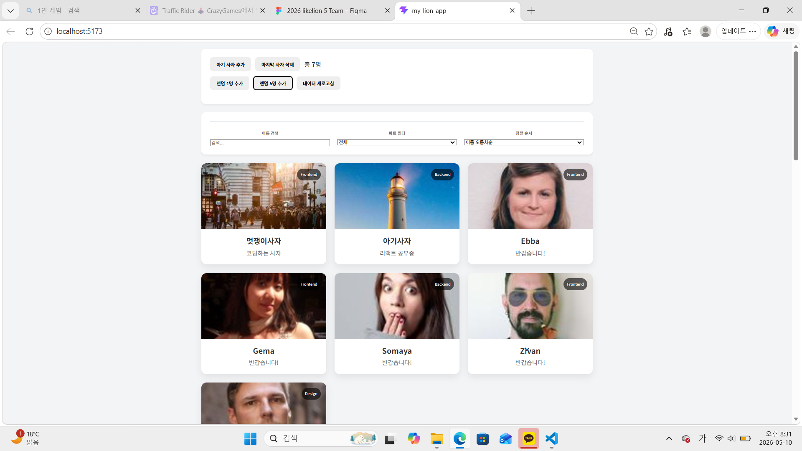
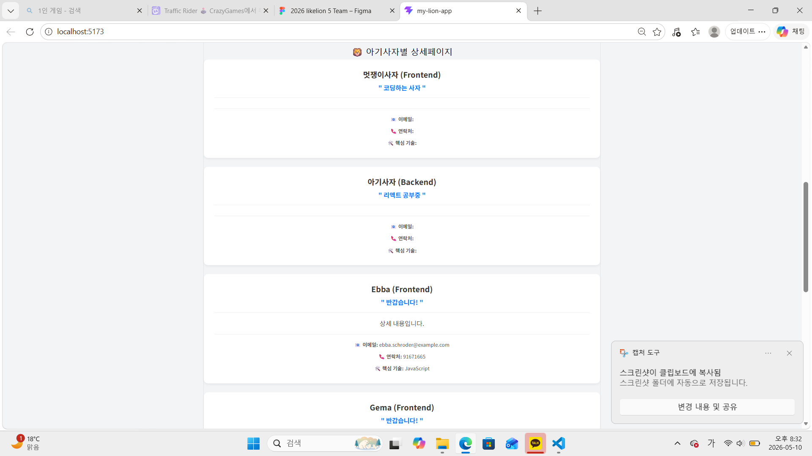
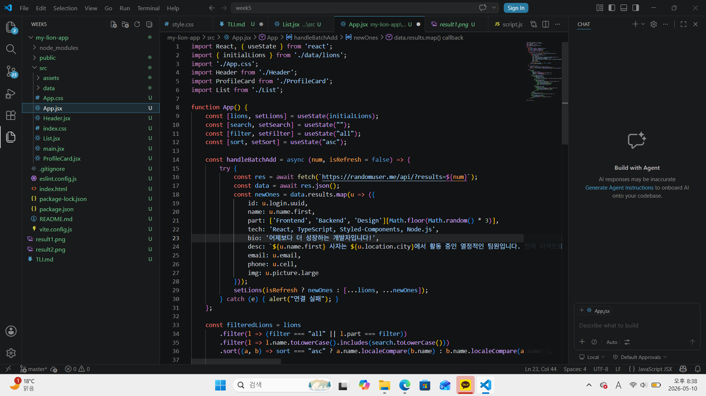
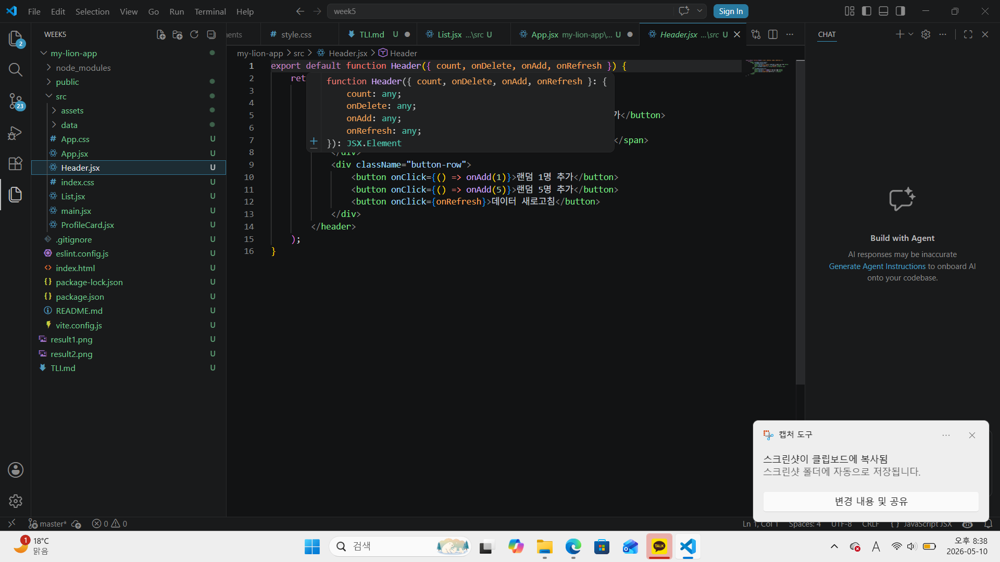
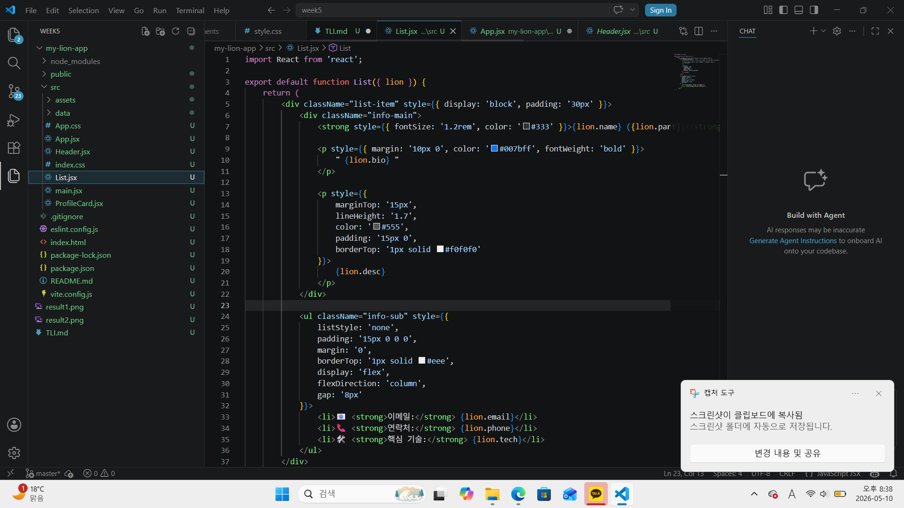
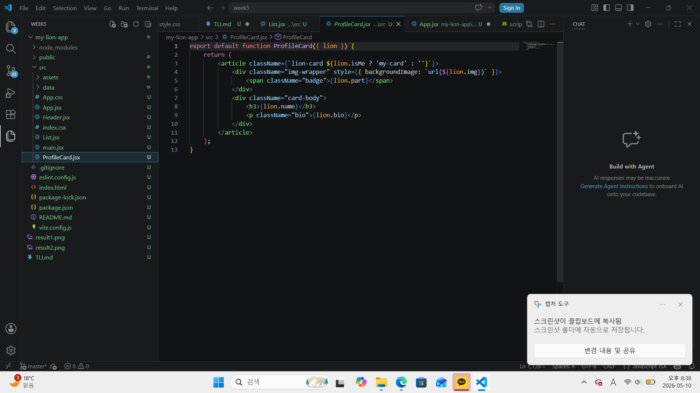

# 📘 Today I Learned

### 1. 오늘 배운 내용
- React의 핵심 개념과 컴포넌트화: 기존의 긴 HTML 파일을 기능별로 쪼개어 Component 단위로 관리하는 법을 학습.

- JSX 문법과 규칙: HTML과 비슷하지만 JavaScript의 강력한 기능을 결합한 JSX의 작성 규칙을 이해하고 적용.

- Props를 통한 데이터 흐름: 부모 컴포넌트에서 자식 컴포넌트로 props를 전달하여, 하나의 데이터 소스로 여러 화면을 일관성 있게 렌더링하는 흐름 파악.

- Vite와 개발 환경 구축: Node.js 환경에서 yarn과 Vite를 사용해 빠르고 효율적인 React 개발 서버를 실행하는 방법.

### 2. 핵심 정리 (내 언어로)
컴포넌트 조립: 화면을 레고 블록처럼 나누어 만드는 것. 한 번 잘 만들어두면 여기저기 재사용하기 편함.

데이터는 위에서 아래로: 데이터는 항상 부모가 자식한테 props라는 보따리에 싸서 보내줘야 함. 자식은 그 보따리를 풀어서 화면에 그리기만 하면 됨.

상태와 UI의 연결: 데이터가 바뀌면 화면도 자동으로 바뀐다는 점이 React의 진짜 매력임. 하드코딩된 HTML에서 벗어나는 게 핵심!

디렉토리 구조의 중요성: src 폴더 안에 components, data, styles를 딱딱 나눠놓아야 프로젝트가 커져도 길을 잃지 않음.

### 3. 결과 이미지(스크린샷)

### 4. 느낀 점
이전까지 HTML/CSS로 한 줄 한 줄 코드를 쌓아 올릴 때는 코드가 길어질수록 수정할 위치를 찾기가 정말 힘들었는데, React로 컴포넌트를 나누니 구조가 한눈에 들어와서 신세계였다. 특히 props 개념이 처음에는 조금 헷갈렸지만, 동일한 데이터로 요약 카드와 상세 정보를 동시에 컨트롤할 수 있다는 점이 매우 효율적이라고 느꼈다. 단순히 화면을 '그리는 것'을 넘어, 데이터를 어떻게 '흐르게' 할 것인지 고민하는 사고방식의 전환이 필요하다는 것을 깨달은 미션이었다.