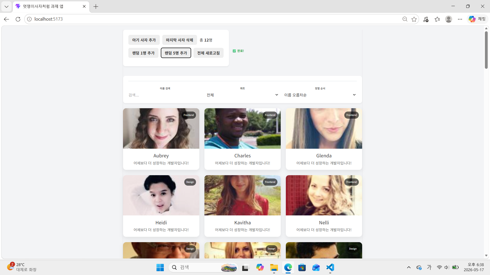
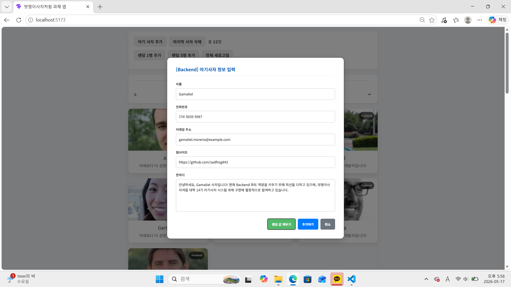
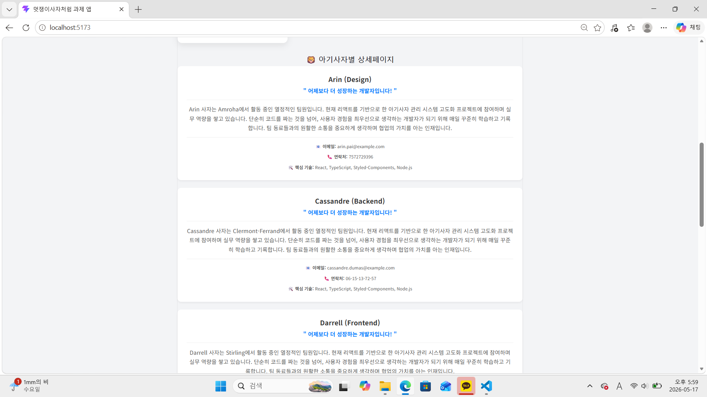
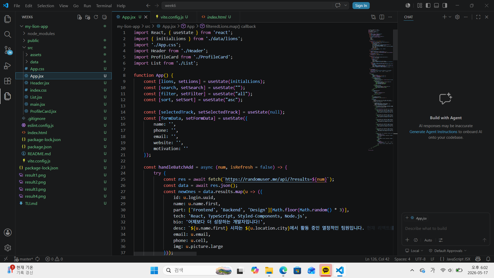
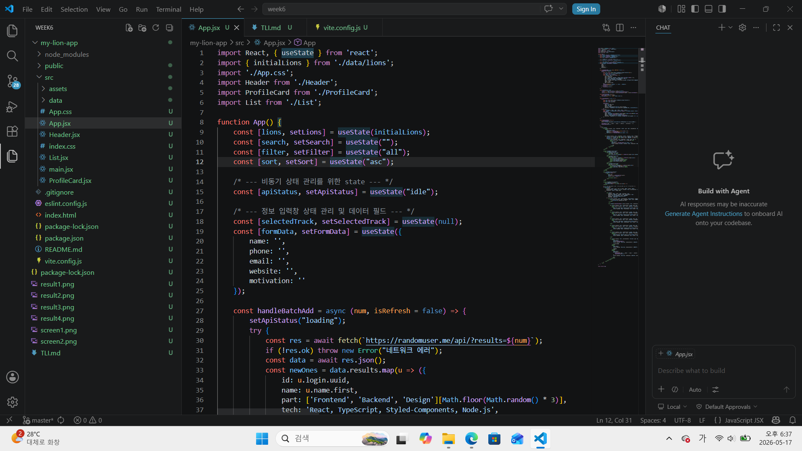

# 📘 Today I Learned

### 1. 오늘 배운 내용
- 배열 메서드를 이용한 선언적 데이터 가공 (.filter(), .sort())

- useState 상태 관리와 Setter 함수를 통한 화면 리렌더링 제어.

- fetch API와 async/await 문법을 활용한 외부 데이터 비동기 연동.

- 스프레드 연산자를 이용한 기존 상태 배열 확장 및 갱신.

### 2. 핵심 정리 (내 언어로)
State로 화면 새로고침 쌔리기: 리액트에서 데이터 바꿀 때 일반 변수 쓰면 백날 수정해 봤자 화면 꿈쩍도 안 함. 무조건 useState로 상태 만들고 전용 Setter 함수를 실행시켜 줘야 리액트가 알아채고 화면을 자동으로 새로고침해 줌.

원본 배열 훼손하면 대형사고: 검색창에 타이핑하거나 필터 고를 때 원본 데이터 상태를 직접 깎아내거나 지우면 안 됨. 나중에 검색어 지웠을 때 복구가 안 돼서 망함. 무조건 원본은 고이 모셔두고, 렌더링 직전에 필요한 알짜배기만 .filter()랑 .sort()로 발라내서 화면에 꽂아주는 게 리액트 정석임.

Async/Await로 브라우저 렉 방지: 외부 서버에서 사자들 데이터 땡겨올 때 네트워크 딜레이가 생기는데, 이거 다 받아올 때까지 브라우저를 붙잡고 있으면 앱이 멈춰서 유저들 다 도망감. 그래서 응답을 기다리는 동안 다른 일도 할 수 있게 비동기 처리랑 fetch로 똑똑하게 데이터를 수신해 줘야 됨.

### 3. 결과 이미지(스크린샷)

### 4. 느낀 점
교안에 나와 있는 대시보드 구조를 직접 실습해 보면서 리액트가 데이터를 얼마나 체계적이고 선언적으로 다루는지 깊게 이해할 수 있는 시간이었습니다. 특히 JavaScript의 기초인 filter()와 sort() 메서드가 리액트의 useState와 결합했을 때, 복잡한 제어 로직 없이도 단 몇 줄의 코드만으로 실시간 검색 및 파트별 정렬 화면을 매끄럽게 만들어내는 과정이 매우 신기했습니다.