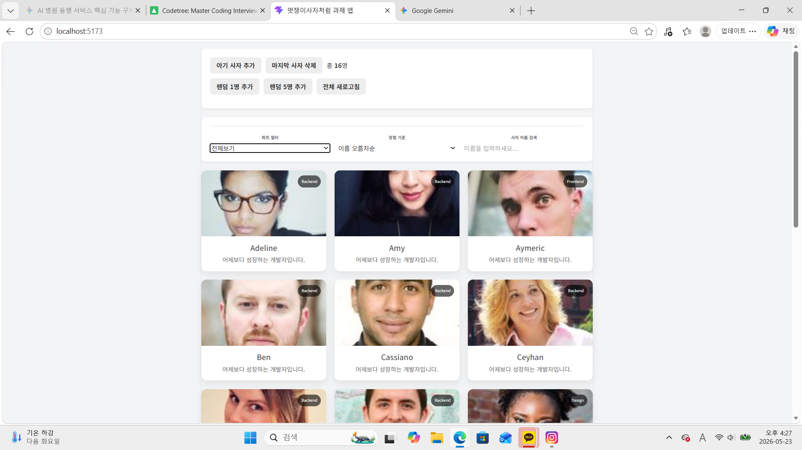
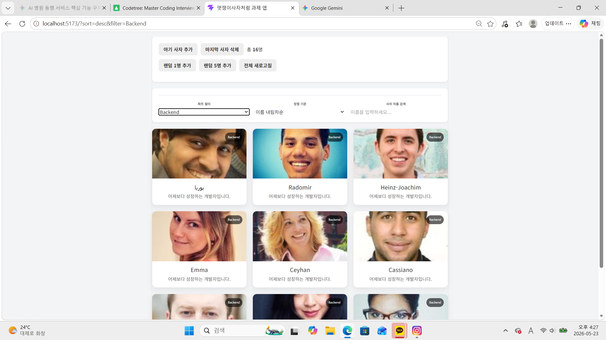
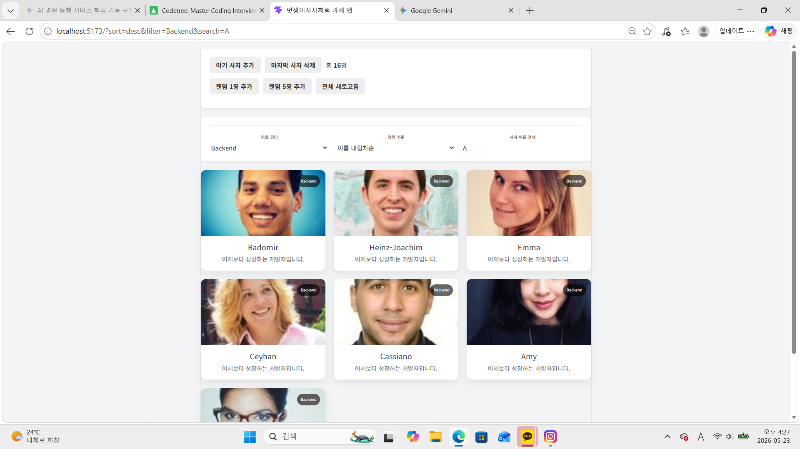
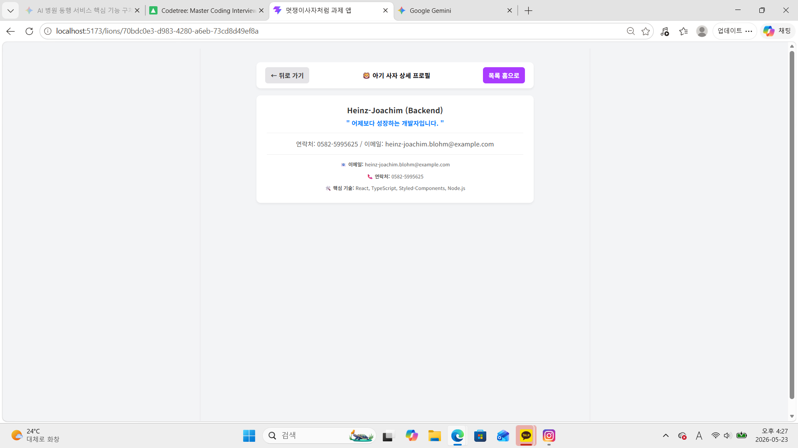
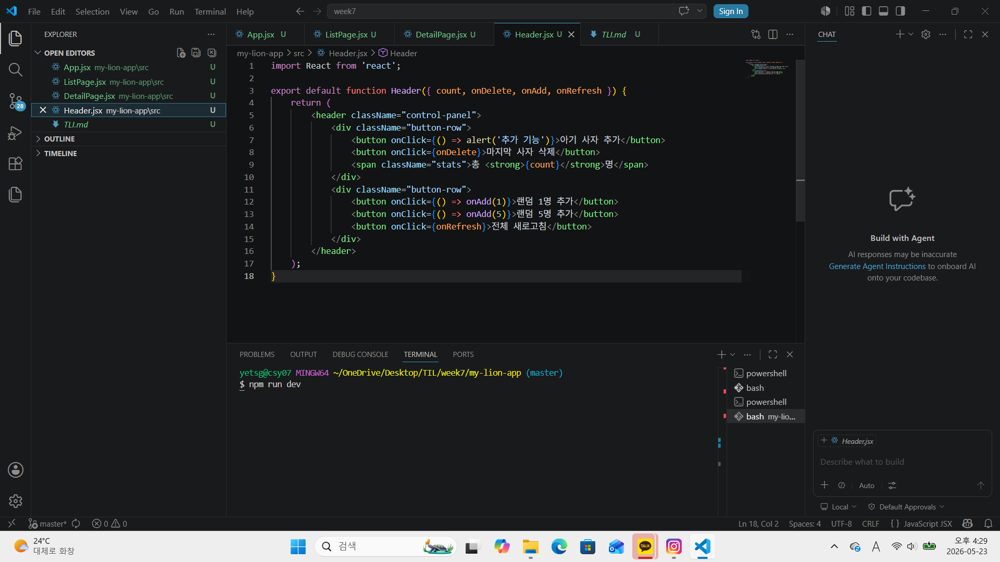
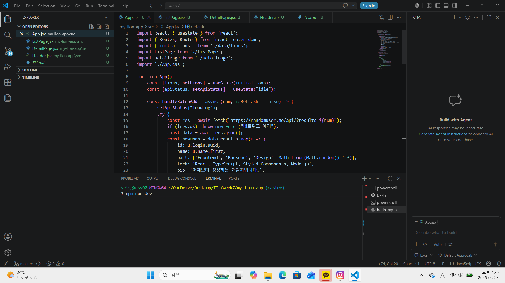
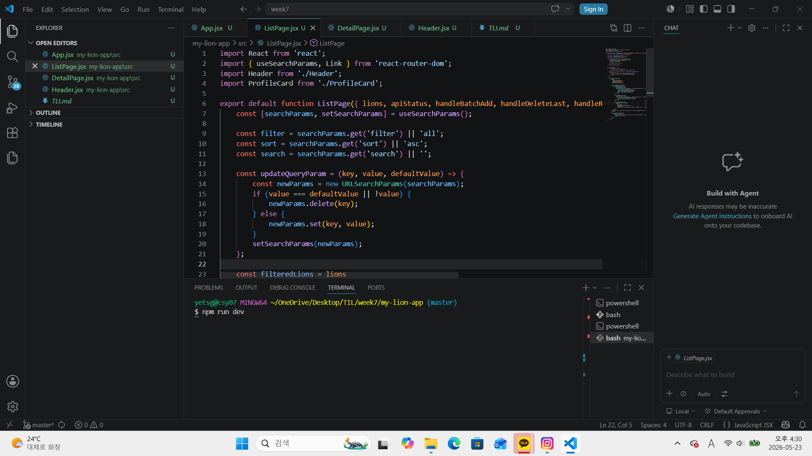
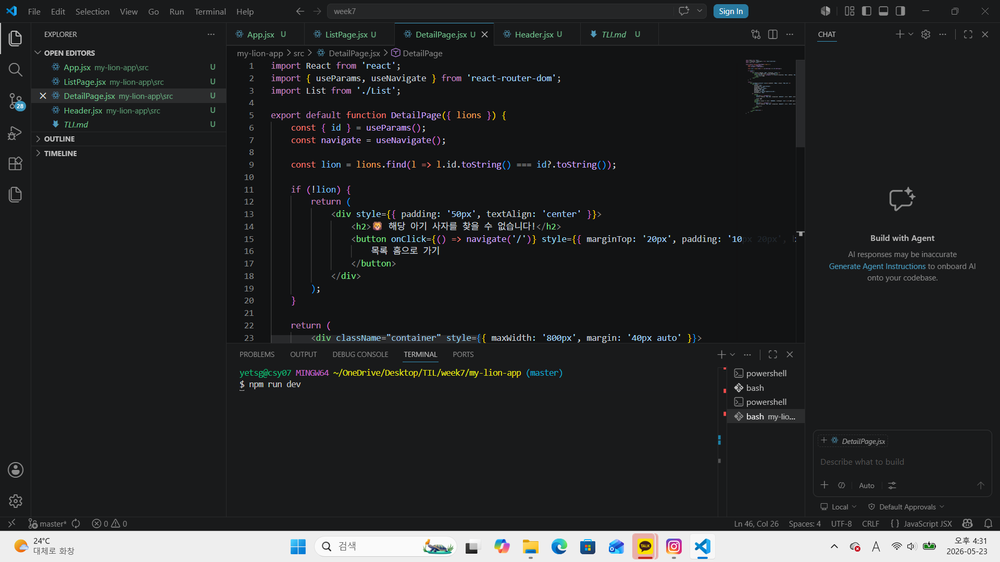

# 📘 Today I Learned

### 1. 오늘 배운 내용
- Single Page Application (SPA)와 라우팅(Routing)의 개념

- URL 파라미터와 동적 라우팅 (Dynamic Routing)

- URL 쿼리 스트링(Query String)과 상태 동기화

### 2. 핵심 정리 (내 언어로)
React Router Dom 설치 및 기본 세팅 마침. main.jsx에서 <App />을 <BrowserRouter>로 감싸주어야 라우팅 기능을 정상적으로 쓸 수 있음.

화면 분할 및 라우트 독립성 확보함. 메인 홈 화면과 상세 프로필 화면을 루트 주소에 따라 완벽하게 분리함. 상세 페이지로 이동 시 메인에 있던 복잡한 헤더나 필터 패널이 완전히 사라지고 상세 카드만 깔끔하게 나오도록 라우팅 설계를 마침.

useNavigate 활용한 네비게이션 제어함. 상단 네비게이션 바에서 Maps(-1) 함수를 호출하여 브라우저의 직전 히스토리로 부드럽게 뒤로 가도록 구현하고, 목록 홈으로 버튼은 Maps('/')를 주어 무조건 메인 홈으로 튕겨가도록 세팅 완료함.

쿼리 파라미터 삭제 조건 처리함. 파트 필터가 'all(전체보기)'이거나 검색어가 비어있을 때는 URL 주소창에 지저분하게 ?filter=all이 남지 않고 깔끔하게 delete되도록 예외 예방 로직을 짬.

Vite 빌드 에러 및 캐시 이슈 해결함. 파일 경로가 꼬이거나 컴포넌트 이식 중에 발생한 파싱 에러는 터미널을 완전 종료한 뒤 .vite 캐시 폴더를 완전히 밀어버리고 npm run dev로 새로고침 구동해야 고스트 에러가 완전히 소멸함을 깨달음.

### 3. 결과 이미지(스크린샷)

### 4. 느낀 점
지난주 코드 위에 React Router Dom을 설계하며 실제 서비스처럼 페이지가 전환되는 웹 앱의 구조를 경험할 수 있었습니다. 폴더 경로 설정이나 Vite 캐시 오류로 인해 초반에 다소 고전하기도 했지만, 버그 원인을 하나씩 분석하고 해결해 나가며 개발자로서 큰 성취감을 느꼈습니다.

특히 화면의 필터링 상태와 주소창의 쿼리스트링을 연동하는 작업을 통해 평소 자주 쓰던 웹 사이트들의 작동 원리를 코드로 깊이 이해할 수 있었습니다. 단순히 UI를 그리는 것을 넘어 사용자의 사소한 행동까지 고려해야 하는 클라이언트 사이드 라우팅의 가치를 체감한 뜻깊은 시간이었습니다.