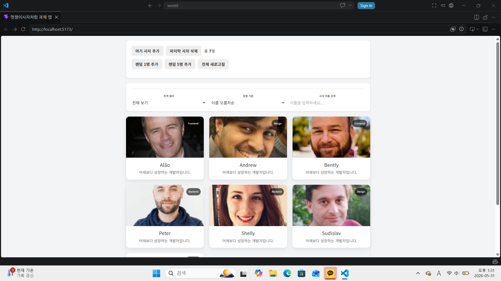
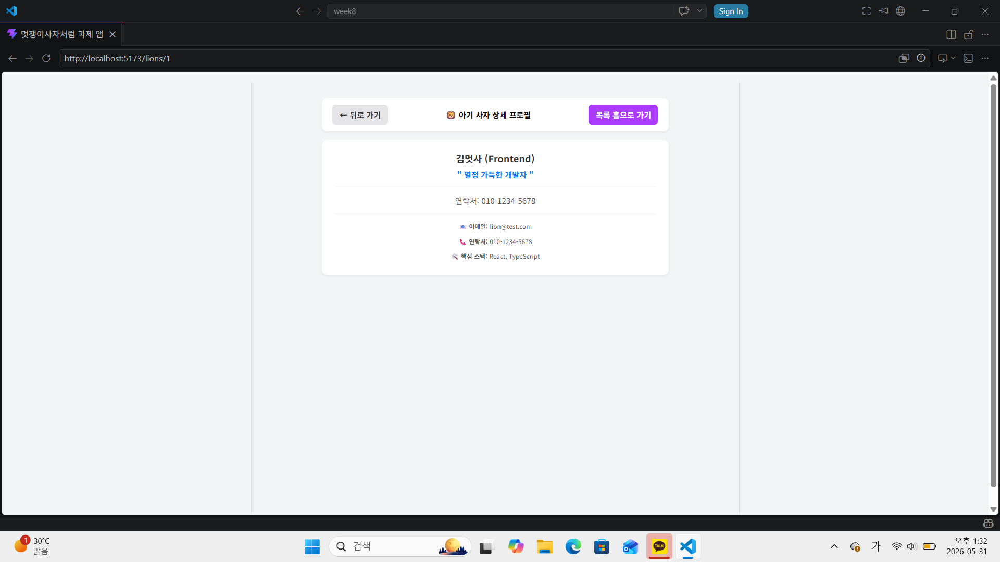
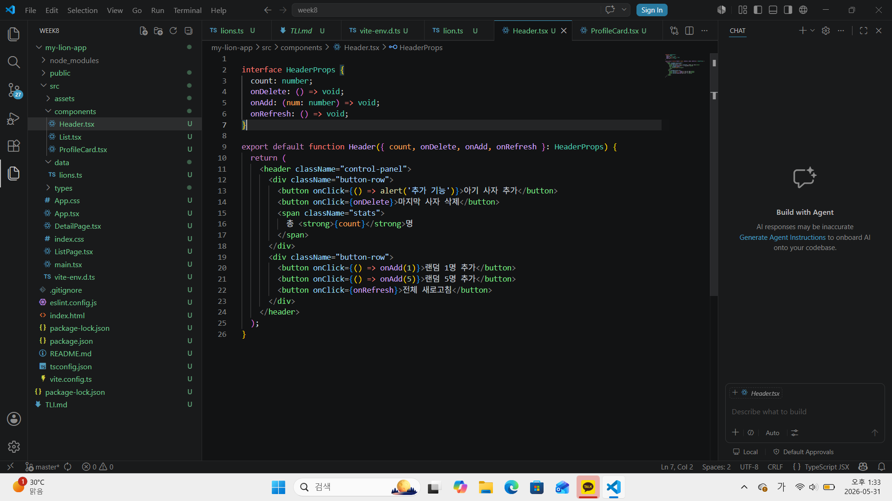
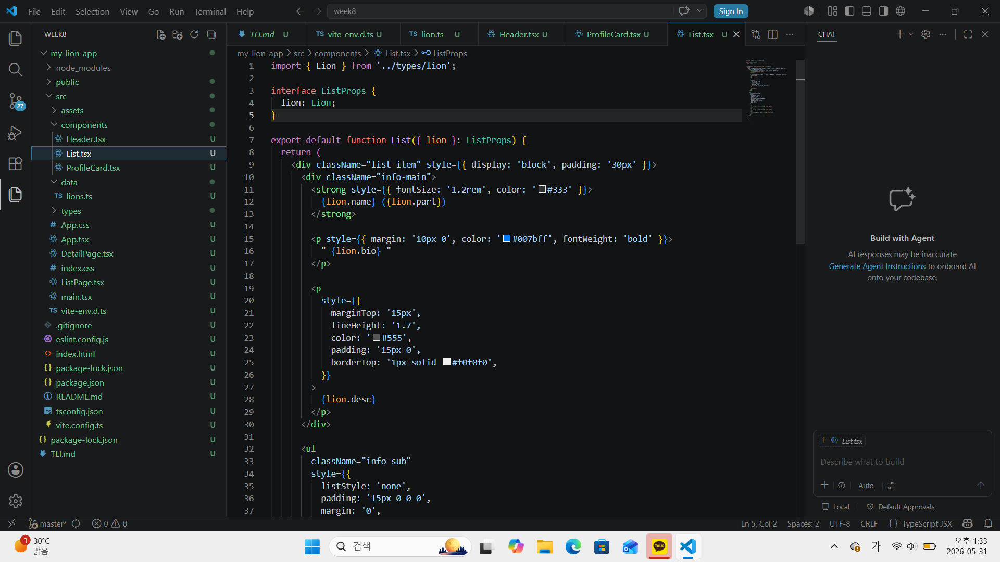
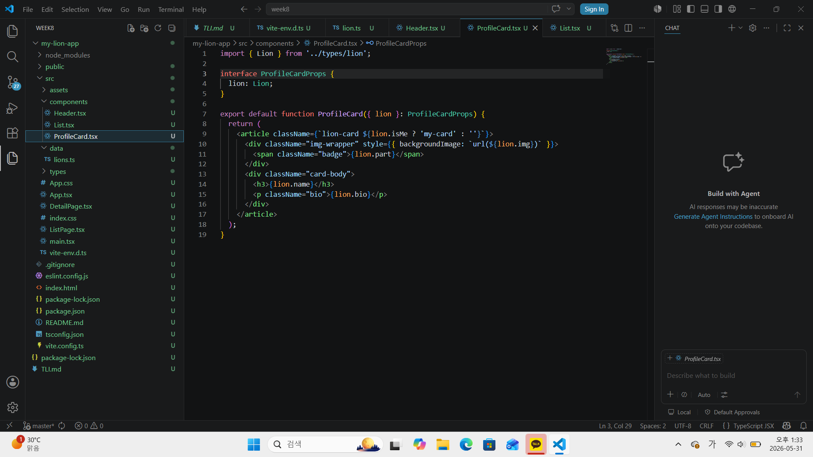
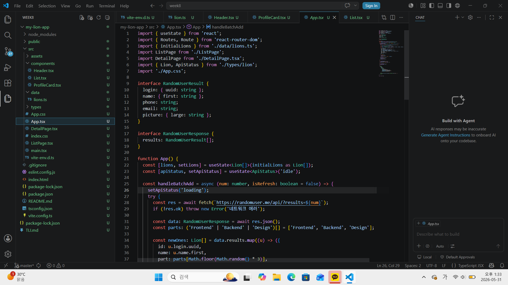
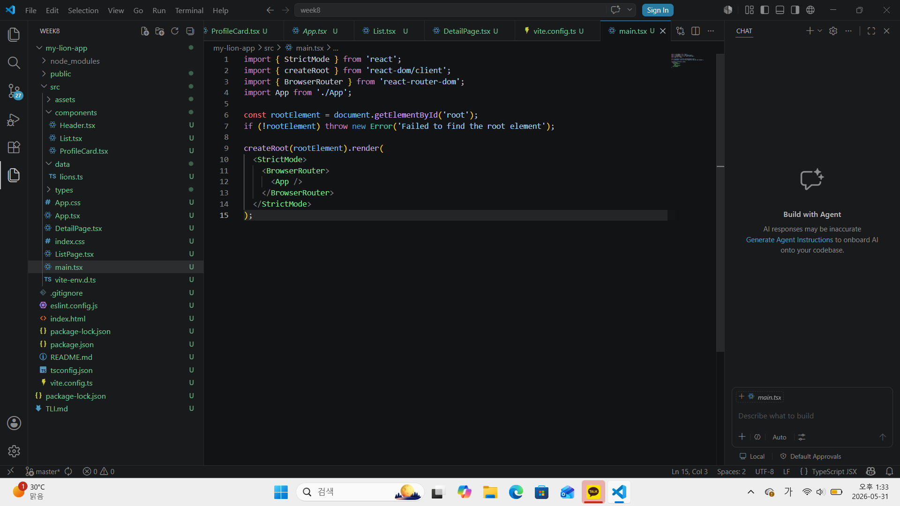
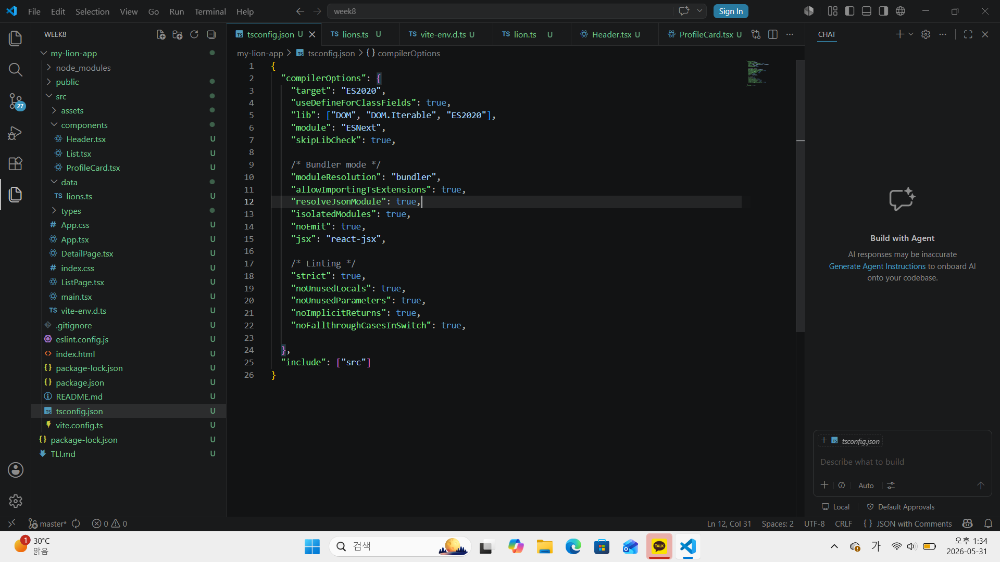

# 📘 Today I Learned

### 1. 오늘 배운 내용
- 확장자 변경에 따른 도미노 현상

- 컴포넌트 위치에 따른 상대 경로 매칭

- 타입스크립트의 모듈 선언 및 타입 단언

- CLI 터미널 경로와 package.json 관리

### 2. 핵심 정리 (내 언어로)
.ts와 .tsx는 한 몸: 컴포넌트 확장자를 바꿨으면 무조건 대문 스크립트 경로와 불러오기 경로까지 확장자 세트로 다 맞춰야 마음이 편함.

옆 동네 갈 때는 문 열고 나가기: 파일 위치가 다르면 무조건 ../로 상위 폴더 탈출부터 한 다음에 다른 폴더 이름을 적어줘야 길을 잃지 않음.

타입스크립트는 깐깐한 사장님: 데이터 알맹이든 CSS 파일이든 "이게 대체 무슨 형태인지" 확실하게 이름표(Lion[])나 선언서(vite-env.d.ts)를 쥐여주지 않으면 절대 통과 안 시켜줌.

터미널 실행 전에 주소 확인: 명령어가 안 먹힐 때는 컴퓨터 탓하지 말고 내 터미널 위치가 알맹이 폴더(my-lion-app) 안에 잘 들어가 있는지부터 확인해야함. cd 명령어가 최고.

### 3. 결과 이미지(스크린샷)

### 4. 느낀 점
처음 확장자를 .tsx로 바꾸고 에러 창이 시빨갛게 뒤덮였을 때는 솔직히 뇌정지가 오고 도망치고 싶었다. 하지만 하나씩 에러를 뜯어보며 타입스크립트가 원하는 입맛대로 경로랑 확장자를 맞춰주니까 마침내 에러가 0개로 지워지고 브라우저 화면이 정상 작동하는 순간 엄청난 카타르시스가 느껴졌다!
에러 메시지는 나를 공격하는 게 아니라 친절하게 정답 주소를 알려주는 나침반이라는 걸 뼈저리게 배운 하루였고, 이제 폴더 구조를 보는 눈이 한 단계 업그레이드된 것 같아서 뿌듯하다.