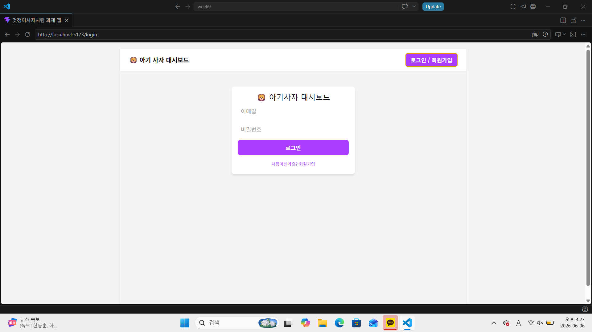
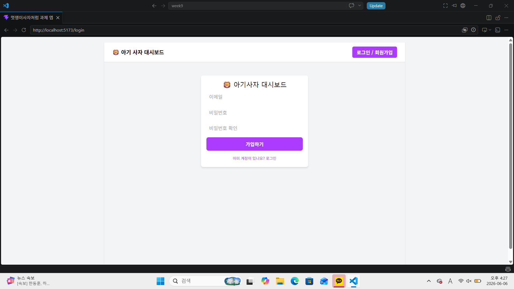
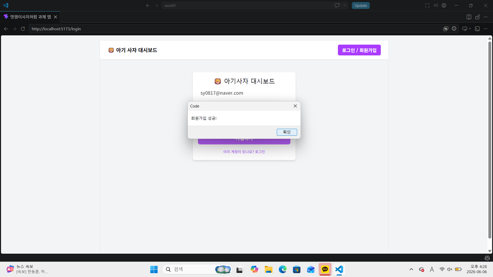
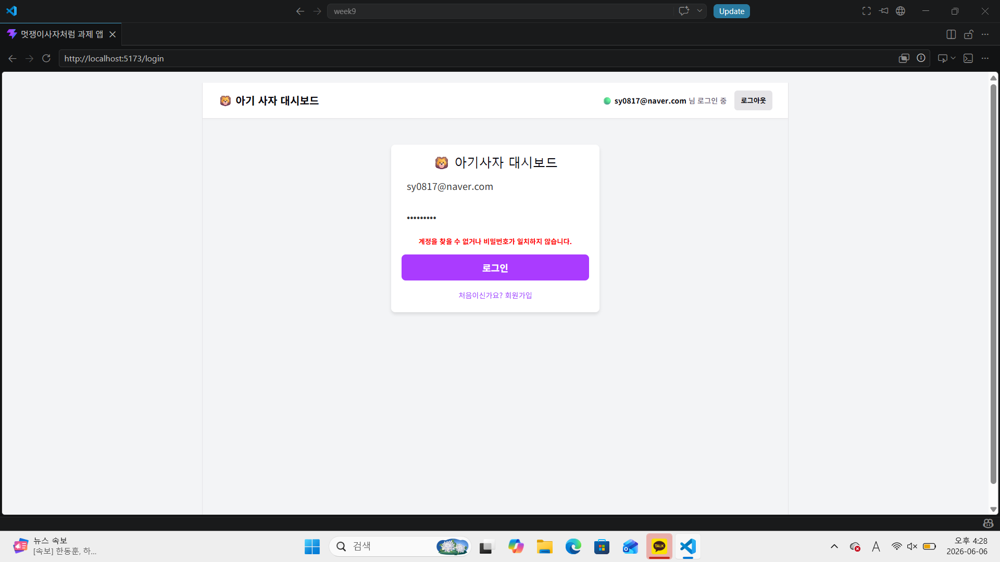
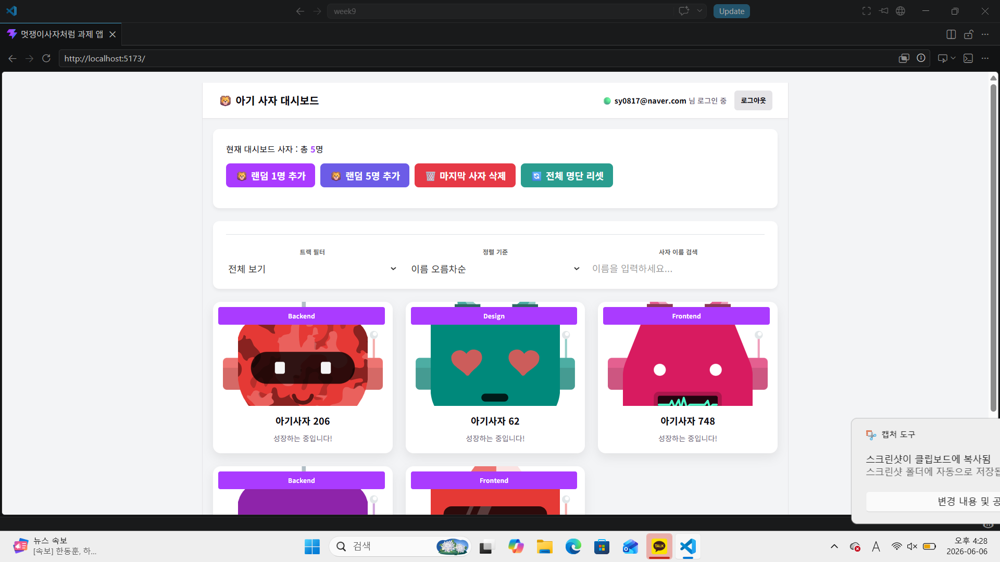
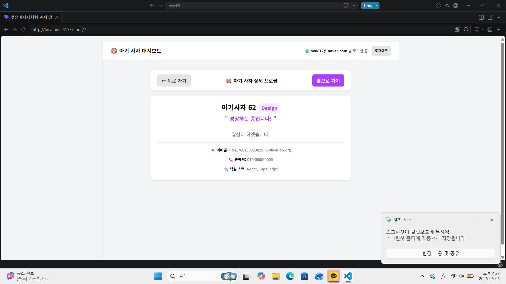
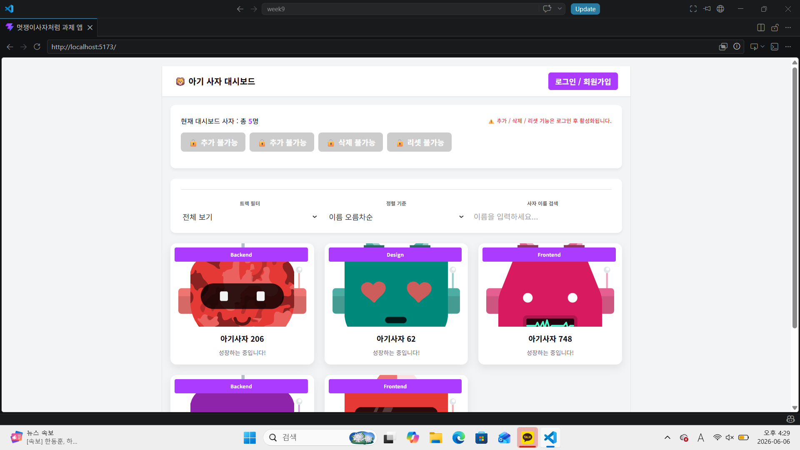
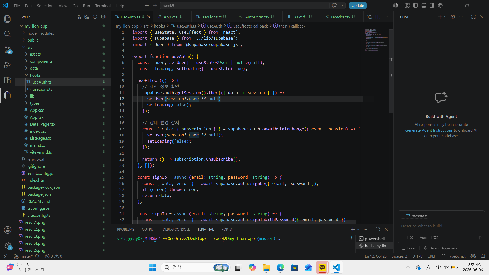
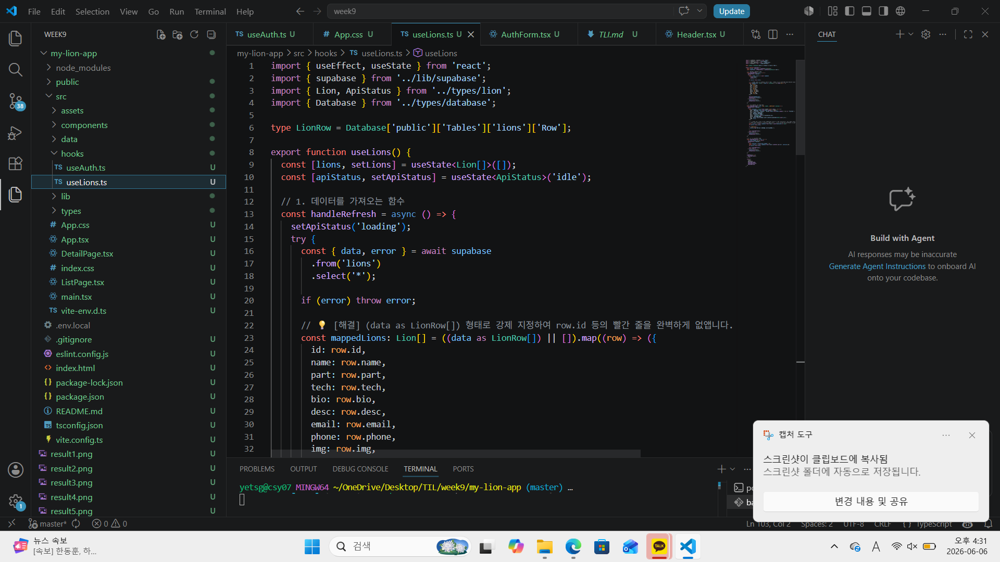
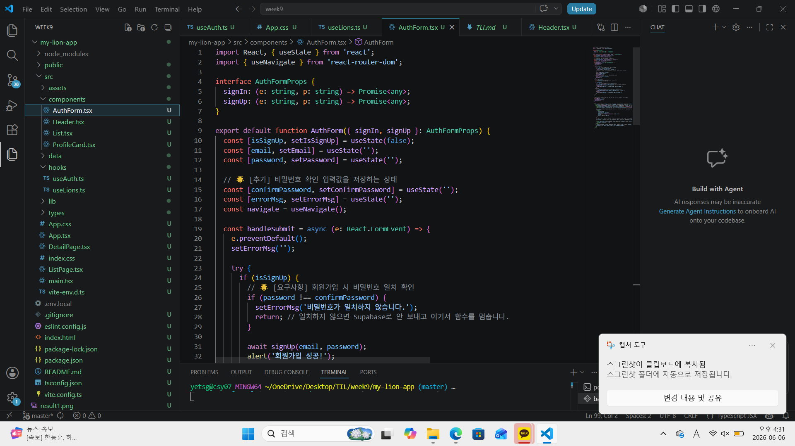

# 📘 Today I Learned

### 1. 오늘 배운 내용
- 데이터베이스(Supabase) 테이블 생성 및 구조 매칭

- 보안 정책(RLS) 해제를 통한 외부 데이터 통신 허용

- 프론트엔드 자체 유효성 검사(비밀번호 일치 확인) 구현

- 백엔드(Supabase) 에러 메시지 분기 처리를 통한 예외 핸들링

### 2. 핵심 정리 (내 언어로)
틀이 없으면 데이터도 없음: 콘솔창에 404 에러나 relation does not exist가 뜨는 건 데이터베이스에 테이블 자체가 없다는 뜻이므로 SQL Editor를 통해 뼈대(테이블)부터 튼튼하게 만들어야 함.

자물쇠는 확실히 풀어야 통함: 테이블을 만들었더라도 RLS 자물쇠가 걸려있으면 웹사이트에서 데이터가 들어가지 않으므로 disable row level security 명령어로 통로를 뻥 뚫어줘야 마음대로 추가가 가능함.

### 3. 결과 이미지(스크린샷)

### 4. 느낀 점
처음에는 끝없이 터지는 빨간색 에러 창과 낯선 Supabase 설정 때문에 막막하고 포기하고 싶었지만, 원인을 하나씩 짚어가며 마침내 화면에 아기 사자 카드가 쫙 깔리는 순간 코딩의 진짜 짜릿함과 성취감을 느낄 수 있었습니다. 코드 한 줄, 명령어 한 줄을 정확하게 입력하는 것이 데이터베이스 통신에서 얼마나 중요한지 뼈저리게 배운 값진 시간이었습니다.